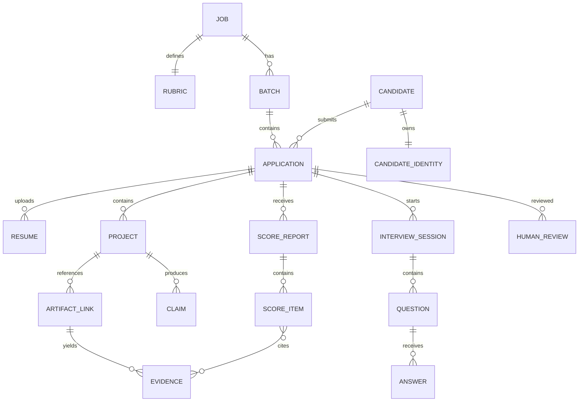
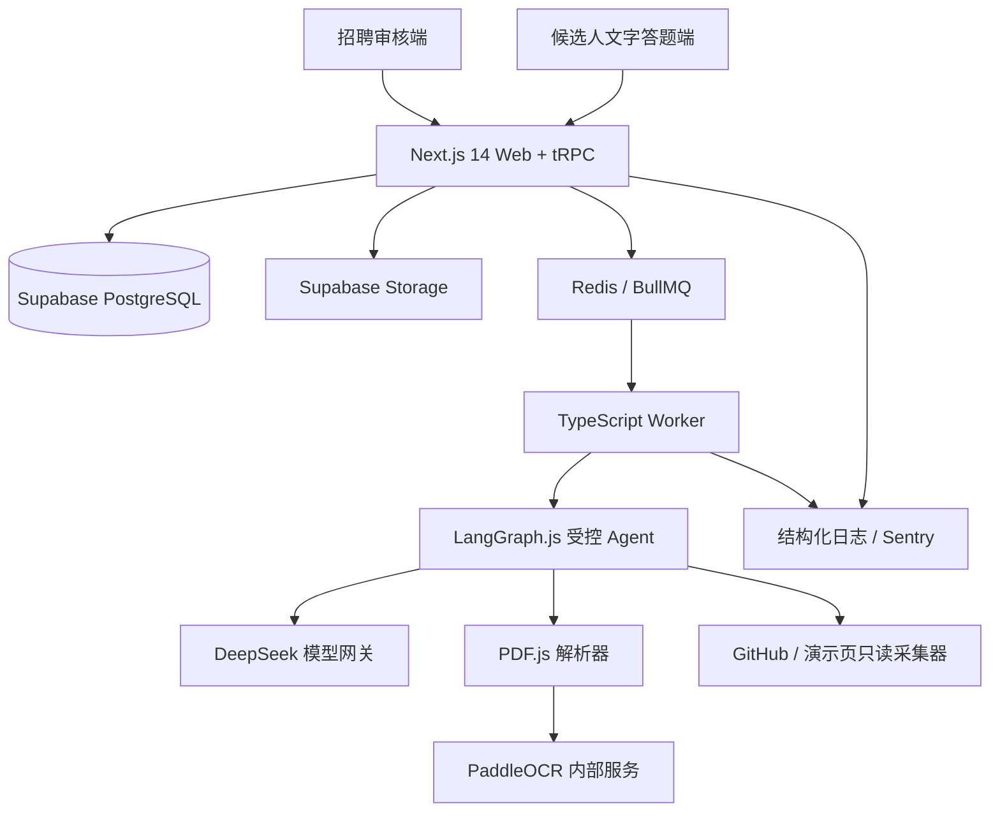

# AI 候选人线上初筛与项目真实性验证系统（PRD + MVP 技术方案 v2）

## 1. 文档定位

本文是面向“AI 应用开发实习生”招聘场景的 PRD 与 MVP 技术方案，目标是在 1～2 周内交付一个可试运行版本，支持单岗位、单批次约 100 位候选人。系统使用 DeepSeek 提供辅助分析，最终是否进入下一轮由 HR 或面试官人工决定。v2 在不改变产品目标的前提下，根据开源项目调研将实现路线调整为“复用 MIT 开源面试平台 + 增量开发证据与 Agent 能力”。

## 2. 假设与决策

- MVP 只支持一个岗位、一个批次约 100 位候选人。
- 线上面试为文字问答，候选人通过一次性链接进入，不注册账号。
- 采用单一招聘审核员角色；HR 与面试官共享审核权限，所有操作写入审计日志。
- 使用 DeepSeek API，但通过模型网关隔离供应商；姓名、手机号、邮箱、学校和原始 PDF 不发送给模型。
- 作品验证只读公开 GitHub、演示页和其他链接，不运行候选人仓库代码，不使用私有仓库令牌。
- 主问题数量由招聘审核员控制，不设硬性题数；系统根据题目估算时长并在预计超过 45 分钟时提醒。默认建议约 30 分钟。
- 采用确定性工作流 + 受控业务 Agent + 确定性评分引擎，不采用端到端自主 Agent。
- MVP 不建立跨候选人知识库或独立向量数据库，使用候选人证据包和 PostgreSQL 检索即可。
- MVP 以 MIT 许可的 `ai-interview-platform` 为 Web 壳层，复用文字面试、问题编辑、候选人链接和报告页面；简历脱敏、证据链和评分模块重新实现。
- 保持开源项目的 Next.js 14、React 18、TypeScript、tRPC 和 Supabase 主栈，MVP 期间不升级大版本。
- 实际开发仓库为 [`4evour/demo-ai-mianshi`](https://github.com/4evour/demo-ai-mianshi)，上游参考仓库为 [`yuanzhongqiao/ai-interview-platform`](https://github.com/yuanzhongqiao/ai-interview-platform)。

## 3. 产品目标与成功标准

### 3.1 目标

将“简历初筛、项目真实性核验、文字面试和人工复核”串成可追溯流程，减少 HR 重复阅读和手工整理工作，同时避免 AI 以无证据的印象直接淘汰候选人。

### 3.2 成功标准

- 单批次可导入并处理约 100 位候选人。
- 普通文本 PDF 解析成功率不低于 95%，解析字段可回溯到原文。
- 从简历中自动识别 GitHub、演示页、博客等作品地址，准确率目标不低于 90%。
- 每个 AI 评分项均能回溯到简历、作品或具体问答证据。
- 题目由审核员确认后才能发布；AI 不能自动改变最终招聘状态。
- DeepSeek 请求中出现姓名、手机号、邮箱、学校等身份字段的次数为 0。
- 模型超时、作品不可访问或解析失败时，流程可转人工继续。

## 4. 角色与业务流程

### 4.1 角色

**候选人**：查看隐私说明，完成自我介绍、项目/实习讲解、个性化问题和动态追问。

**招聘审核员**：创建 JD、确认评分量表、审核解析结果、编辑问题、查看报告、修改建议分并作最终决策。

### 4.2 主流程

```text
岗位 JD
→ JD 结构化与评分量表确认
→ 批量上传 PDF 简历
→ 文本/OCR 解析、脱敏、作品地址自动提取
→ JD 匹配 Agent 生成预评估
→ 真实性验证 Agent 采集公开证据
→ 个性化出题 Agent 生成问题计划
→ 审核员选择、编辑并发布问题
→ 候选人文字作答
→ 动态追问 Agent 按证据缺口追问
→ 评分证据 Agent 生成分项建议分
→ 报告审校 Agent 检查引用和矛盾
→ 审核员查看报告、个性化建议追问并作最终决策
```

### 4.3 候选人状态

```text
IMPORTED → PARSING → PARSE_REVIEW_REQUIRED / READY
→ ASSESSMENT_PREPARING → INVITED → IN_PROGRESS
→ SUBMITTED / EXPIRED → AI_REVIEWING
→ HUMAN_REVIEW_REQUIRED → ADVANCED / REJECTED / ON_HOLD
```

`PARSE_REVIEW_REQUIRED` 表示字段缺失或置信度低；`ON_HOLD` 表示作品暂不可访问或证据冲突，均不等于淘汰。AI 不得直接设置 `ADVANCED` 或 `REJECTED`。

### 4.4 P0、P1 与非 MVP

**P0**

- 单岗位 JD 创建、结构化和量表确认
- PDF 上传、文本/OCR 解析、脱敏、字段人工纠错
- 自动识别并关联 GitHub、演示页、博客等作品地址
- JD 匹配、公开作品只读验证和声明—证据关系
- 审核员可控制、排序、编辑、删除和重新生成问题
- 自我介绍、项目讲解、实习经历条件题、项目深挖、JD 能力题
- 候选人一次性链接、自动保存、文字答题和受限动态追问
- 评分报告、证据引用、置信度、矛盾和待确认项
- 面试官个性化建议追问列表
- DeepSeek 调用、异常和审计日志
- 人工审核、改分、备注和最终决策

**P1**

- 二维码识别作品地址
- 多岗位和评分模板复用
- 多审核员分配、批量邀请和统计对比
- 候选人补充材料入口
- 私有 GitHub 授权
- 历史人工判断驱动的评分校准

**明确不做**

- AI 自动淘汰、自动录用或自动进入下一轮
- 语音、视频、情绪和摄像头反作弊分析
- 自动运行候选人代码
- 任意互联网自主浏览
- 面试排期、Offer、薪资和复杂多租户权限
- 使用年龄、性别、学校层级等敏感属性评分

## 5. 问题设计与人工控制

### 5.1 默认问题蓝图

AI 应用开发岗位的默认问题顺序为：

1. 自我介绍和岗位动机。
2. 选择简历核心项目进行完整讲解。
3. 若存在实习经历，讲解职责、产出和困难。
4. 围绕核心项目进行技术深挖和真实性验证。
5. 针对 JD 要求但简历证据不足的能力提问。
6. 针对简历中的突出成果或技术亮点提问。

第 3、5、6 类为条件题；没有对应材料时不生成。主问题数量不设硬上限，但系统估算完成时长，超过 45 分钟提示审核员。动态追问次数由审核员配置，默认整场最多 3 次。

### 5.2 审核员控制

审核员可以勾选、取消、排序、编辑、单题重新生成、手动新增问题，指定必须考察的技能、项目和深挖程度。问题计划必须经审核员确认后才能发布。

### 5.3 个性化建议追问

最终报告独立展示“面试官参考追问”，每条包括问题、追问目的、触发证据、期望观察信号和适用时机。例如：

```json
{
  "question": "你提到命中率从 78% 提升到 86%，测试集是否在调参前固定？",
  "purpose": "确认指标是否存在测试集污染",
  "trigger_evidence_ids": ["EVD-006", "ANS-041"],
  "expected_signals": ["数据划分", "评测口径", "偏差意识"],
  "when_to_ask": "技术面试中需要进一步确认评测可信度时"
}
```

这些建议不自动发给候选人，面试官可以采纳、编辑或忽略。

## 6. 数据设计

主要对象包括：

- `job`：岗位名称、原始 JD、结构化要求和状态。
- `rubric`：量表版本、维度、权重、要求级别和确认人。
- `batch`：岗位批次、截止时间和候选人数。
- `candidate`：随机 `public_code`；不含身份信息。
- `candidate_identity`：加密存储姓名、手机号、邮箱和学校，与分析数据隔离。
- `application`：候选人与岗位批次的关联、状态和风险标签。
- `resume`：对象存储文件键、哈希、解析状态、结构化 JSON 和字段置信度。
- `project`：项目名称、时间、角色、技术栈和项目声明。
- `artifact_link`：作品 URL、类型、关联项目、访问状态和最近检查时间。
- `claim`：可验证声明，例如“独立实现重排模块”。
- `evidence`：来源、摘录、哈希、抓取时间、可靠性和状态。
- `interview_session`：一次性链接哈希、开始和提交时间、时长限制。
- `question` / `answer`：问题类型、目标维度、证据引用、回答和父子追问关系。
- `score_report` / `score_item`：报告版本、模型版本、分项分、置信度和理由。
- `human_review`：人工决策、改分、备注、原因和审核人。
- `model_call_log`：任务类型、模型、提示词版本、耗时、Token、状态和错误码。
- `audit_log`：查看、修改、状态变化、前后版本哈希和操作时间。

核心关系如下：



每条证据通过 `supports`、`contradicts`、`insufficient`、`unavailable` 与项目声明和评分项关联。模型结论不能作为无来源证据。

MVP 不为每位候选人建立独立向量库。按 `candidate_id`、`project_id`、`dimension` 在 PostgreSQL JSONB 和全文索引中筛选相关证据，形成候选人证据包后传入模型。未来材料量显著增加时再考虑 `pgvector`。

## 7. AI 与 Agent 工作流

### 7.1 简历解析 Agent

PDF.js 在服务端 Worker 中提取文本、页码和 PDF 超链接注释；无文本层时调用独立 PaddleOCR 容器。规则先识别 URL、手机号和邮箱并完成脱敏，DeepSeek 只处理脱敏文本并输出固定 JSON。作品地址自动规范化、去重、分类并关联项目，解析结果保留页码、摘录和提取方式。选择 PDF.js 是为了与复用项目的 TypeScript 技术栈一致，并避免 PyMuPDF 的 AGPL/商业双许可风险。

### 7.2 JD 匹配 Agent

Agent 将 JD 拆解为硬性要求、优先要求和加分项，关联简历和作品证据，生成匹配等级、缺口和验证方向。审核员确认量表后权重冻结；Agent 不能改变权重，分数由规则引擎计算。

### 7.3 真实性验证 Agent

只读调用 GitHub 公开 API 和安全页面采集器，读取仓库元数据、README、目录树、有限代码片段、提交摘要、依赖和演示页可访问性。禁止执行代码、下载二进制、携带凭证访问私有资源。结果只能是支持、矛盾、证据不足或暂不可访问，不能直接输出“造假”。

### 7.4 个性化出题 Agent

先生成问题计划，再生成题目。输入包括 JD 缺口、项目声明、亮点、已用问题和验证证据。问题审校器执行语义去重、相关性、敏感问题和前雇主机密检查；失败最多重写两次，仍失败则使用安全题库降级。

### 7.5 动态追问 Agent

只允许 `ASK_FOLLOW_UP`、`NEXT_QUESTION`、`END_INTERVIEW` 三个动作。回答短、答非所问、声明矛盾、个人贡献不清或存在新证据缺口时触发追问；整场次数和单题次数由配置限制。候选人拒答后不持续施压。

### 7.6 评分证据与报告审校 Agent

评分 Agent 将回答拆成声明，绑定简历、作品和问答证据，输出建议等级、证据状态和置信度；确定性引擎计算分项和总分。审校 Agent 检查引用存在性、结论支持关系、量表遵守、敏感属性推断和矛盾遗漏。失败报告必须转人工。

## 8. 评分体系

| 维度 | 权重 |
|---|---:|
| 岗位匹配度 | 25% |
| 专业技能掌握度 | 20% |
| 项目真实性 | 20% |
| 问题分析与解决能力 | 20% |
| 表达清晰度 | 10% |
| 证据完整性 | 5% |

能力等级为 0～4：0 表示没有有效证据，1 表示只能复述概念，2 表示可完成简单任务，3 表示能说明实现、取舍和排错，4 表示能深入分析边界、失败模式和改进。

```text
分项得分 = 能力等级 / 4 × 维度权重 × 证据系数
```

证据系数：多来源印证 1.00，问答与公开作品印证 0.90，简历与问答一致 0.75，仅本人自述 0.55，证据不足 0.30，明确矛盾 0.10。

置信度分为高（≥0.80）、中（0.60～0.79）、低（<0.60）。低置信度只能作为建议分并进入待确认项。没有证据不得用常识补全；无 GitHub、私有仓库或演示页不可访问只能标记证据不足，不能直接判定虚假。

人工与 AI 总分相差超过 20 分、核心维度相差超过 2 个等级，或人工大幅修改真实性结论时，触发重点复核。人工修改必须填写原因，保留 AI 原始报告和最终报告两个版本。

## 9. 数据安全与异常兜底

### 9.1 数据边界

发送给 DeepSeek 的只有脱敏 JD、简历片段、项目、公开证据摘录和问答。禁止发送姓名、联系方式、学校、原始 PDF、内部备注、访问令牌和其他候选人数据。模型网关负责 PII 扫描、JSON Schema 校验、限流、重试和敏感响应扫描。

原始 PDF 放入加密对象存储；身份表与分析表隔离；一次性链接只存哈希。审核员不能查看 API Key、删除审计日志或导出完整未脱敏数据。

建议默认保留：原始 PDF 3 个月，招聘材料和报告 6 个月，模型调用元数据和审计日志 12 个月，具体按公司政策调整。

### 9.2 异常处理

| 异常 | 自动处理 | 人工兜底 |
|---|---|---|
| PDF 无文本、损坏或 OCR 失败 | 保存原文件并标记解析失败 | 手动录入核心字段或要求重新上传 |
| 字段识别错误或置信度低 | 展示原文页码、摘录和候选值 | 审核员逐字段确认或修正 |
| 作品地址解析错误 | 保留原 URL，标记未关联 | 审核员重新关联项目或补充地址 |
| 没有作品链接 | 不降低真实性分 | 通过项目讲解和追问补充验证 |
| GitHub 私有或暂不可访问 | 标记 `unavailable`，限次重试 | 允许补充截图、说明或其他材料 |
| 回答过短或答非所问 | 触发一次澄清追问 | 仍不足则记录证据不足并继续 |
| 候选人拒绝回答 | 标记 `declined`，停止施压 | 由审核员判断是否需要线下确认 |
| 重复、不相关或不合适的问题 | 去重、合规校验并最多重写两次 | 使用安全题库或人工编辑 |
| DeepSeek 调用失败或超时 | 指数退避重试两次 | 使用模板题、规则结果或转人工 |
| JSON 输出不符合 Schema | 自动修复或重新调用一次 | 标记节点失败，不阻塞其他流程 |
| AI 与人工判断差异较大 | 标记差异并保留两个版本 | 以人工决定为准并要求填写原因 |

任何 Agent 失败都允许跳过该节点继续人工处理。

## 10. MVP 技术方案

### 10.1 架构与选型



- Web：Fork `ai-interview-platform`，保留 Next.js 14、React 18、TypeScript、tRPC 和现有问题编辑、分享链接、文字会话、结果页。
- 数据：Supabase PostgreSQL、Auth、Storage 和 RLS；使用 JSONB、全文索引和独立身份表保存数据。
- 异步：BullMQ + Redis；解析、GitHub 采集、出题和评分不在 Web 请求内同步执行。
- Agent：LangGraph.js；负责受控 Agent 节点、checkpoint、人工 interrupt、工具白名单和循环上限。
- 模型：使用 OpenAI JS SDK 对接 DeepSeek 兼容接口；所有输出用 Zod 校验。
- PDF：PDF.js 提取文本、页码和链接注释；扫描件降级到 PaddleOCR 内部容器。
- GitHub：Octokit + GitHub REST API；使用系统只读服务凭证、ETag 缓存和限流，不使用候选人 Token。
- 页面采集：Node.js `fetch`/Undici + HTML 解析，执行 SSRF、内容类型、响应大小和重定向限制。
- 监控：结构化日志、Sentry、`model_call_log` 和 `audit_log`；Langfuse 放入 P1。
- 部署：Docker Compose 运行 Web、Worker、Redis 和 OCR；Supabase 可使用托管版或本地自托管环境。

建议代码结构：

```text
apps/web/               Next.js 审核端、候选人端和 tRPC
apps/worker/            BullMQ Worker 与 LangGraph.js
packages/contracts/     Zod 输入输出契约
packages/evidence/      声明、证据和确定性评分规则
services/ocr/           PaddleOCR 内部服务
supabase/migrations/    表、索引、RLS 和审计触发器
```

### 10.2 核心接口

内部审核端优先使用 tRPC，候选人一次性链接和异步任务状态使用稳定的 HTTP Route Handler。以下为逻辑接口，不要求 URL 与被复用项目完全一致：

```text
tRPC job.create / rubric.generate / rubric.publish
tRPC batch.create / application.import / resume.correct
tRPC artifact.verify / questionPlan.generate / questionPlan.publish
tRPC report.get / review.submit / audit.list

POST /api/v1/applications/{id}/resume
GET  /api/v1/tasks/{task_id}
POST /api/v1/applications/{id}/invite
GET  /api/v1/interviews/{token}
PUT  /api/v1/interviews/{token}/answers/{question_id}/draft
POST /api/v1/interviews/{token}/answers/{question_id}
POST /api/v1/interviews/{token}/submit
```

耗时接口向 BullMQ 投递任务并返回 `202 Accepted` 和 `task_id`，前端轮询任务状态。候选人提交答案后只返回下一道已发布问题或 Zod 校验后的受控追问，不暴露内部评分。内部 Worker 使用 Supabase 服务角色，但只允许在服务器环境运行，前端永不持有服务角色密钥。

### 10.3 指标与排期

目标：普通 PDF 解析成功率 ≥95%，链接识别 ≥90%，评分项有效引用率 100%，敏感字段外发 0 次，候选人自动保存 P95 <500ms，普通 API P95 <800ms，单候选人预分析 P95 <10 分钟。

10 个工作日排期：

1. Fork 并锁定开源平台版本，关闭语音、视频、反作弊和复杂组织功能。
2. 增加身份隔离、申请、简历、项目、作品和任务表，并配置 RLS。
3. 实现 PDF.js 文本/链接提取、规则脱敏、OCR 降级和人工纠错。
4. 建立声明—证据模型、BullMQ Worker 和 DeepSeek 模型网关。
5. 实现 GitHub/演示页采集、缓存、限流和 SSRF 防护。
6. 实现 JD 量表、匹配 Agent 和确定性评分工具。
7. 改造问题计划、审核员编辑发布、文字答题和动态追问。
8. 实现评分证据绑定、报告审校和面试官建议追问。
9. 完成人工改分、最终决策、审计、异常重试和监控。
10. 执行端到端、PII 外发、SSRF、100 人批处理和证据追溯验收。

### 10.4 上线验收

- 文本、扫描、损坏和含超链接 PDF 均有明确处理结果。
- DeepSeek 请求中不存在身份字段。
- GitHub 公开、私有、404、超时和重定向场景均可处理。
- SSRF、内网地址、云元数据地址和文件下载被阻断。
- 审核员可以完整控制问题计划和个性化建议追问。
- 短答、答非所问、拒答和追问上限符合配置。
- 每个评分项可回溯到原始证据，矛盾不被平均值掩盖。
- DeepSeek 空响应或 Schema 失败后可重试、降级或转人工。
- Supabase RLS 阻止候选人访问他人会话、评分和身份信息。
- 100 名虚拟候选人批处理成功或明确失败。
- AI 不可直接改变最终招聘状态。

### 10.5 开源复用与许可证边界

| 项目 | 决策 | 复用范围 | 主要限制 |
|---|---|---|---|
| [`ai-interview-platform`](https://github.com/yuanzhongqiao/ai-interview-platform) | Fork + Extend | Next.js/Supabase 壳层、问题编辑、文字会话、分享链接、报告 UI | 当前简历解析会向模型发送身份信息，文本标记状态机和平均分逻辑必须替换 |
| [`Resume-Matcher`](https://github.com/srbhr/Resume-Matcher) | 参考模式 | LLM JSON 解析、Schema 校验、原文规则校正和测试分层 | 面向求职者优化简历，不提供招聘证据链 |
| [`OpenResume`](https://github.com/xitanggg/open-resume) | 仅参考 | PDF.js 行分组、章节识别和本地解析思路 | AGPL-3.0；闭源系统不得直接复制代码，且中文简历适配有限 |
| [`OpenCATS`](https://github.com/opencats/OpenCATS) | 仅参考 | ATS 状态流转和候选人管理概念 | PHP 老架构；许可证需进一步确认 |
| [`LangGraph`](https://github.com/langchain-ai/langgraph) | 采用 | 状态机、checkpoint、interrupt 和人工确认 | 不管理最终招聘状态或自行改变评分公式 |
| [`PaddleOCR`](https://github.com/PaddlePaddle/PaddleOCR) | 采用 | 中文扫描 PDF OCR | 只在无文本层时降级调用 |

不直接照搬 `ai-interview-platform` 的三个原因：其现有简历接口会把完整简历和身份信息发送给外部模型；会话通过 `[NEXT_QUESTION]` 等自由文本标记推进；总分主要采用问题分数平均值。这三部分与本方案的脱敏、结构化动作和证据评分要求冲突，必须重写。

DeepSeek JSON Mode 可能偶尔返回空内容，因此模型网关必须执行“空响应检查 → Zod 校验 → 最多重试两次 → 转人工”。GitHub 未认证 REST API 限额不足以支持 100 人批次，因此必须使用系统只读凭证、ETag 缓存和调用限流。

### 10.6 架构决策

“Fork 现有平台而非从零构建”的完整背景、替代方案和后果记录在 [`ADR-001`](../decisions/ADR-001-fork-ai-interview-platform.md) 中。

## 11. 完整示例

以下候选人及项目均为虚构数据。

### 11.1 简历解析结果

候选人编号 `AI-2026-0042`，预计 2027 年毕业，有一段 AI 应用开发实习经历。技能包括 Python、FastAPI、DeepSeek API、LangChain、Qdrant、SQLite 和基础 Docker。

核心项目 DocPilot 是面向技术文档的 RAG 问答系统。候选人声称负责文档处理、检索、重排和评测，并将 Top-5 命中率从 78% 提升至 86%。系统从 PDF 超链接注释中自动提取公开 GitHub 地址，从正文中提取演示地址。

| 证据 ID | 来源 | 观察结果 |
|---|---|---|
| `EVD-001` | 简历第 1 页 | 声称熟悉 Python、FastAPI 和 RAG |
| `EVD-002` | 简历第 2 页 | 声称负责 DocPilot 的检索、重排和评测 |
| `EVD-003` | GitHub 目录 | 存在 `retrieval.py`、`rerank.py` 和 `evaluate.py` |
| `EVD-004` | GitHub 依赖文件 | 使用 Qdrant、DeepSeek SDK 和第三方重排模型 |
| `EVD-005` | GitHub 提交摘要 | 项目周期内有连续提交，但公开账号不能单独证明个人身份 |
| `EVD-006` | README | 记录命中率从 78% 提升至 86%，未说明测试集构建方法 |
| `EVD-007` | 演示页 | 页面可访问，可以上传文档并进行文字提问 |
| `EVD-008` | GitHub 配置 | 存在 Dockerfile，未发现 PostgreSQL 使用证据 |

### 11.2 JD 匹配结论

| JD 要求 | 结论 | 证据 | 待验证项 |
|---|---|---|---|
| Python/FastAPI | 较匹配 | `EVD-001`、`EVD-003` | 异常处理和接口设计能力 |
| 大模型 API | 匹配 | `EVD-004`、`EVD-007` | 超时、限流和降级设计 |
| RAG 与检索 | 较匹配 | `EVD-002`～`EVD-006` | 评测集是否可靠 |
| Git 协作 | 部分匹配 | `EVD-005` | 个人贡献边界 |
| Docker | 初步匹配 | `EVD-008` | 是否实际部署过 |
| PostgreSQL | 证据不足 | 无 | 只看到 SQLite 经历 |

JD 匹配建议分为 81/100，置信度 0.76。该结果用于辅助出题，不直接决定候选人去留。

### 11.3 审核员确认的问题计划

系统生成问题计划后，审核员取消一题、修改一题，最终发布以下 7 道主问题，其中第 3～7 题为基于该候选人经历生成的个性化问题：

1. 请简要介绍你的技术经历，并说明为什么希望从事 AI 应用开发。
2. 请以 DocPilot 为例，说明项目解决的问题、整体架构、你的职责和最终结果。
3. 请介绍知识库问答实习中你实际负责的功能、交付结果和遇到的最大困难。
4. 你提到 Top-5 命中率从 78% 提升到 86%。请说明测试集如何构建、指标如何计算，以及哪些改动带来了提升。
5. 仓库包含检索、重排和评测模块。请具体区分哪些部分由你完成，哪些来自框架、开源模型或其他协作者。
6. 如果 DeepSeek API 连续超时或返回不符合 Schema 的内容，你会如何设计重试、降级和错误记录？
7. DocPilot 当前使用 SQLite。如果需要支持 100 个并发用户并迁移到 PostgreSQL，你会调整哪些数据和部署设计？

### 11.4 某个回答触发的两次追问

候选人对第 4 题回答：

> 我先用向量检索召回 20 条，再用 BGE 重排模型选前 5 条。加入重排后，命中率从 78% 提升到 86%。检索和重排部分主要由我完成。

第一次追问：

> 这组命中率基于多少条查询？“命中”具体如何定义，测试集是否在调参前固定？

候选人回答：

> 一共 120 条查询，由我根据项目文档手工整理。只要前 5 条中包含对应文档就算命中。测试集一开始没有完全固定，后面比较重排方案时固定了 80 条。

第二次追问：

> 由于前期测试集参与了方案调整，你认为 86% 可能有哪些偏差？如果重新评测，你会如何划分数据并避免调参污染？

候选人回答：

> 86% 可能偏高，因为部分问题我在调试时已经看过。我会划分开发集和最终测试集，最终测试集不参与参数调整，并增加无法回答的问题和改写后的查询。

Agent 结论：候选人能解释实现并识别测试集污染风险；“86%”有实现依据，但不能视为严格的泛化效果证明。

### 11.5 最终评分与证据

| 维度 | 得分 | 置信度 | 主要证据 |
|---|---:|---:|---|
| 岗位匹配度 | 19.7/25 | 0.82 | `EVD-001`、`EVD-003`、`EVD-004`、问题 6 回答 |
| 专业技能掌握度 | 15.3/20 | 0.79 | `EVD-003`、`EVD-004`、问题 2/4/6 回答 |
| 项目真实性 | 14.4/20 | 0.74 | `EVD-002`～`EVD-007`、问题 4/5 回答 |
| 问题分析与解决能力 | 15.8/20 | 0.84 | 问题 4 及两次追问、问题 6 回答 |
| 表达清晰度 | 8.5/10 | 0.86 | 全部文字回答 |
| 证据完整性 | 2.8/5 | 0.68 | 公开仓库和演示可用，实习材料不可公开验证 |
| **总分** | **76.5/100** | **0.78** | 仅作为人工审核建议 |

风险和待确认项：86% 指标存在测试集污染；公开提交记录不能单独证明全部个人贡献；PostgreSQL 和高并发经验缺少直接证据；实习项目只能通过问答部分验证。未发现足以支持“项目虚假”的证据。

### 11.6 面试官个性化建议追问

1. 你在实习项目中负责的代码边界是什么？请举例说明一次从日志、定位到修复上线的完整过程。目的：确认实习中的实际贡献和排错能力。依据：实习经历只有本人陈述。
2. 如果把 Qdrant 换成 PostgreSQL + pgvector，你会如何设计索引、迁移、回滚和效果对比？目的：验证 JD 中尚无直接证据的 PostgreSQL 能力。依据：`EVD-008`。
3. 你的 86% 命中率在改写查询和无法回答问题上是否仍然成立？目的：继续确认评测覆盖和泛化能力。依据：`EVD-006` 和两次追问回答。

这些问题只作为面试官参考，不自动发送给候选人。面试官可采纳、编辑或忽略。

## 12. AI 工具使用说明

AI 用于需求拆解、产品流程设计、Agent 边界讨论、评分体系草拟、异常场景整理和示例生成。最终方案中的安全边界、人工审核规则、评分证据约束和技术取舍需要由项目负责人结合公司合规要求和实际招聘流程确认。
